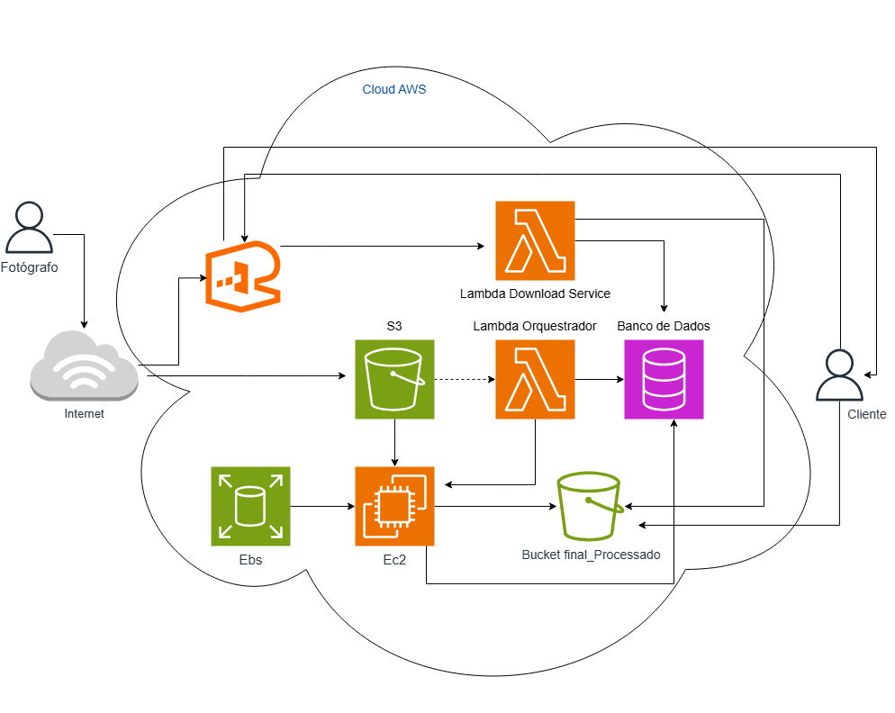

# Projeto 01 — Pipeline de Pós-Produção de Imagens em Alta Escala

Este projeto apresenta uma arquitetura AWS voltada para **processamento inteligente de arquivos RAW** de alta resolução, garantindo **desempenho, economia e segurança**.  
A proposta é simples: o estúdio paga **somente pelo tempo de uso** do servidor pesado (EC2), sem mantê-lo ativo 24h. ⚡  

---

## 💡 Ideia Central

O objetivo é otimizar custos e automatizar o fluxo de pós-produção fotográfica.  
Quando o fotógrafo faz o upload de novas imagens, o **Lambda Orquestrador** detecta o evento e aciona uma **instância EC2** com **EBS** apenas durante o processamento.  
Após o término, o servidor é desligado automaticamente e o cliente recebe um **link seguro e temporário** para download. 🔒  

Essa abordagem elimina custos fixos, acelera a entrega e mantém total rastreabilidade dos arquivos processados.

---

## ⚙️ Detalhamento do Fluxo

1. **Upload e Armazenamento**  
   O fotógrafo envia as imagens pela Internet → **API Gateway**, que as direciona para o **S3 (Bucket RAW)**.  

2. **Acionamento Automático**  
   O upload no S3 aciona o **Lambda Orquestrador**, que registra o job no **banco de dados (DynamoDB/RDS)** e inicia a **instância EC2** com o **volume EBS** anexado.  

3. **Processamento**  
   O EC2 baixa as imagens do S3, realiza o processamento pesado (redimensionamento, correção de cor, geração de versões web) e envia os resultados para o **Bucket final_Processado**.  
   Ao finalizar, atualiza o status no banco e **se desliga automaticamente**. 💨  

4. **Entrega Segura**  
   Quando o cliente solicita o download, o **API Gateway** chama o **Lambda Download Service**, que valida o status e gera uma **URL pré-assinada do S3**, permitindo um **download direto e seguro via HTTPS**.

---

## 🚀 Benefícios

- 💰 **Custo sob demanda:** o EC2 é utilizado apenas durante o processamento.  
- 🧠 **Automação completa:** orquestração via AWS Lambda e eventos S3.  
- 🔒 **Segurança e rastreabilidade:** controle de acesso e links temporários.  
- ☁️ **Escalabilidade:** a arquitetura se ajusta automaticamente ao volume de trabalho.  

---

> *Fluxo: Fotógrafo → API Gateway → S3 → Lambda Orquestrador → EC2/EBS → Bucket Final Processado → Lambda Download → Cliente*

---

**👩‍💻 Autora:** Maria Eduarda Carvalho da Silva  
📧 [Conecte-se comigo no LinkedIn](https://www.linkedin.com/in/maria-eduarda-carvalho-da-silva)
