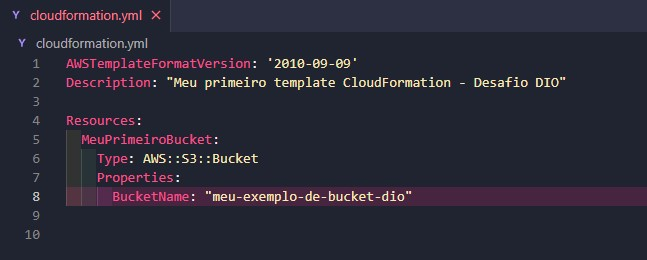
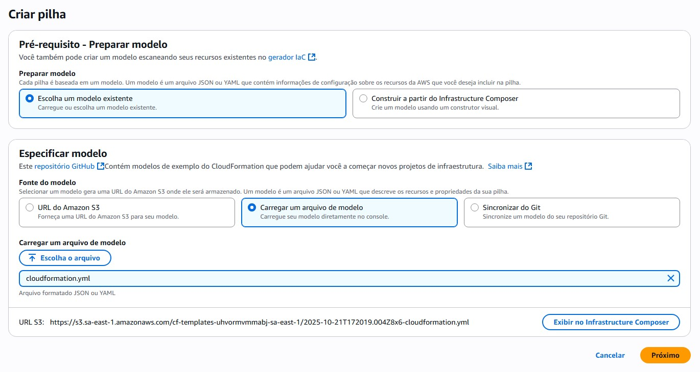
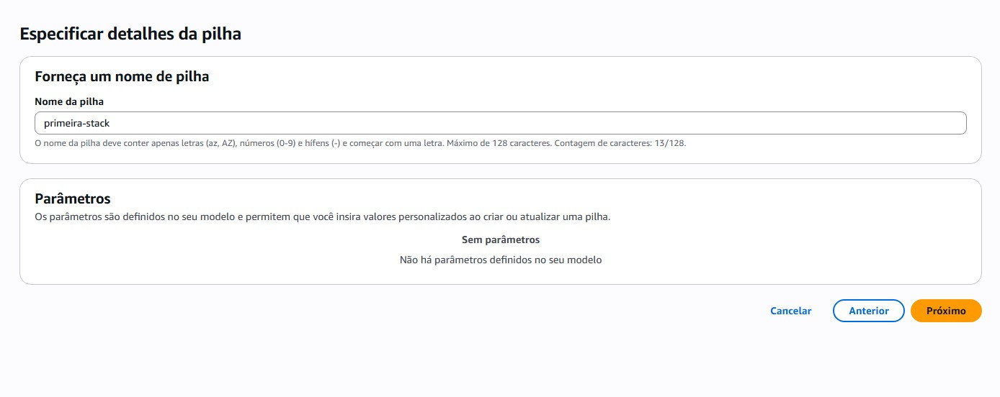
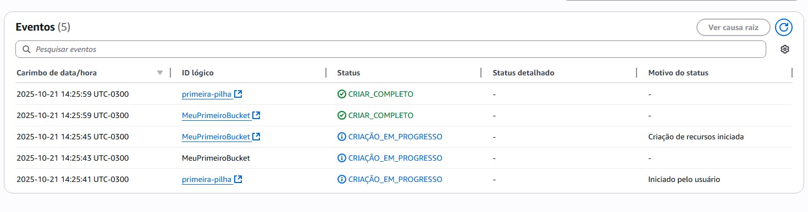
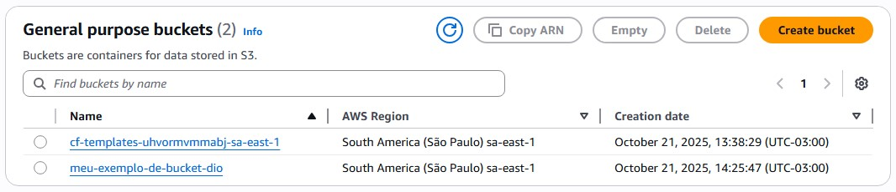

## ☁️ Implementando Minha Primeira Stack com AWS CloudFormation

**Desafio DIO | Infraestrutura como Código (IaC) na Prática**

Este repositório documenta a conclusão do desafio prático da **Digital Innovation One (DIO)**, focado em utilizar o **AWS CloudFormation** para provisionar e gerenciar infraestrutura na AWS através de código.

O objetivo foi implementar uma **Stack** simples, criando um **Amazon S3 Bucket**, e documentar todo o processo, incluindo os conceitos fundamentais.

-----

### 💡 Conceitos Fundamentais de CloudFormation

#### O que é AWS CloudFormation?

CloudFormation é um serviço da AWS que permite modelar e provisionar coleções de recursos da AWS de maneira ordenada e previsível, utilizando o paradigma de **Infraestrutura como Código (IaC)**.

| Conceito | Descrição |
| :--- | :--- |
| **Infraestrutura como Código (IaC)** | Prática de gerenciar infraestrutura usando arquivos de configuração (código) em vez de processos manuais. |
| **Template (YAML/JSON)** | O arquivo que define os recursos da AWS a serem provisionados (o "blueprint" da infraestrutura). |
| **Stack (Pilha)** | A instância em execução do seu template, gerenciando a coleção de recursos como uma única unidade. |
| **Recursos (`Resources`)** | A seção essencial onde você declara os serviços e componentes da AWS que serão criados. |
| **Parâmetros (`Parameters`)** | Variáveis que permitem que usuários insiram valores personalizados ao iniciar a Stack, tornando o template flexível. |

#### 🏗️ Estrutura Mínima de um Template (YAML)

Abaixo estão as seções principais que compõem um template do CloudFormation, com foco na seção `Resources`, que é a única obrigatória:

  * **`AWSTemplateFormatVersion`**: Define a versão do formato do template (sempre `'2010-09-09'`).
  * **`Description`**: Texto explicativo sobre a finalidade da Stack.
  * **`Parameters`**: (Opcional) Valores de entrada que o usuário pode fornecer.
  * **`Resources`**: **(Obrigatória)** Onde os serviços da AWS são declarados e configurados.

-----

### 🎯 1. Definição da Infraestrutura (Template YAML)

Nosso template (`cloudformation.yaml`) utiliza a seção `Resources` para definir a criação de um Bucket do S3:

```yaml
Resources:
  MeuPrimeiroBucket:
    Type: AWS::S3::Bucket
    Properties:
      BucketName: "meu-exemplo-de-bucket-dio"
```

  * **Nome Lógico:** `MeuPrimeiroBucket` (Identificador interno da Stack).
  * **Tipo de Recurso:** `AWS::S3::Bucket`.
  * **Propriedade:** `BucketName` define o nome físico do Bucket no S3.

\<p align="center"\>
\
\</p\>

-----

### ⬆️ 2. Criação da Stack no Console

Carregamos o template YAML diretamente no console do CloudFormation.

  * **Fonte do modelo:** Selecionamos **"Carregar um arquivo de modelo"** e fizemos o upload do `cloudformation.yaml`.

\<p align="center"\>
\
\</p\>

### 🏷️ 3. Nomenclatura da Pilha

Definimos o nome que será usado para gerenciar esta coleção de recursos.

  * **Nome da pilha (Stack Name):** `primeira-stack`
  * **Parâmetros:** Não foram definidos parâmetros, então prosseguimos.

\<p align="center"\>
\
\</p\>

-----

### ✅ 4. Monitoramento e Conclusão

O CloudFormation iniciou o provisionamento dos recursos. A aba **Eventos** confirma o sucesso:

  * O Status da Pilha (`primeira-pilha`) e do Recurso (`MeuPrimeiroBucket`) atingiram: **CRIAR\_COMPLETO**.

| ID Lógico | Status | Detalhe |
| :--- | :--- | :--- |
| `primeira-pilha` | **CRIAR\_COMPLETO** | Stack criada com sucesso. |
| `MeuPrimeiroBucket` | **CRIAR\_COMPLETO** | Recurso S3 provisionado. |

\<p align="center"\>
\
\</p\>

### 🌐 5. Verificação do Recurso (S3)

O console do Amazon S3 mostra o Bucket criado, confirmando que o CloudFormation provisionou a infraestrutura conforme o código.

  * **Nome do Bucket:** `meu-exemplo-de-bucket-dio`
  * **Região:** South America (São Paulo) `sa-east-1`

\<p align="center"\>
\
\</p\>

-----

### 🧠 Ganhos de Aprendizado e Benefícios do IaC

Ao concluir este desafio, internalizei os seguintes conceitos:

  * **Repetibilidade Garantida:** A Stack será sempre criada da mesma forma, eliminando erros de configuração manual.
  * **Gerenciamento Centralizado:** O CloudFormation gerencia o ciclo de vida completo dos recursos (criação, atualização e deleção) em um único ponto de controle.
  * **Documentação Viva:** O template YAML serve como a documentação exata e auditável da infraestrutura.
  * **Diferenciação:** Compreendi a distinção crucial entre o **Nome Lógico** do Recurso no template e o **Nome Físico** (visível no serviço AWS).

**O desafio de implementar a primeira Stack com AWS CloudFormation foi concluído com sucesso\!**

-----

### 📂 Estrutura do Repositório

```
.
├── cloudformation.yaml  # O template IaC utilizado
├── README.md            # Este arquivo detalhado
└── images/              # Pasta com as capturas de tela do passo a passo
```
