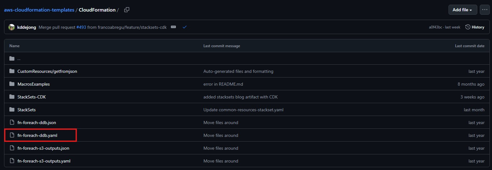
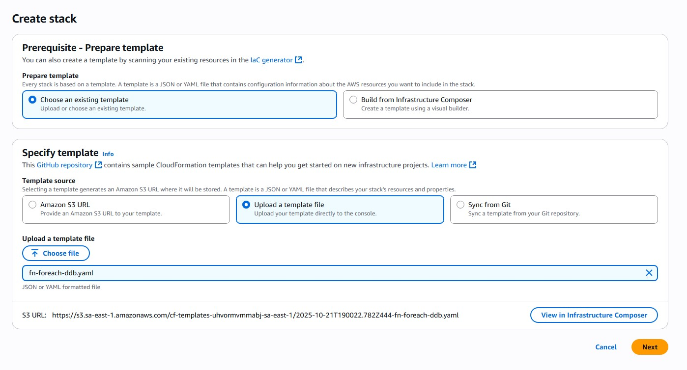
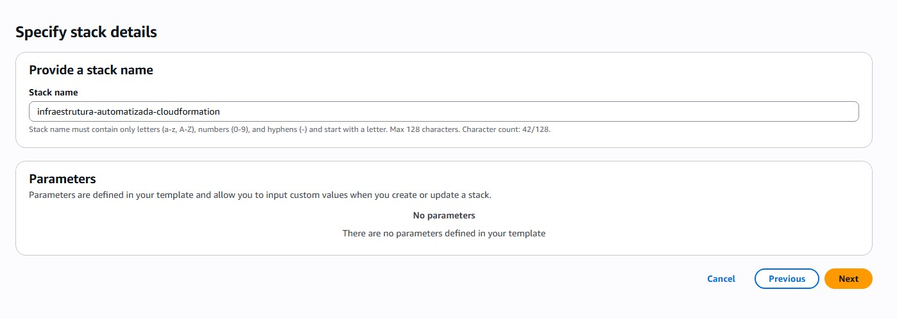
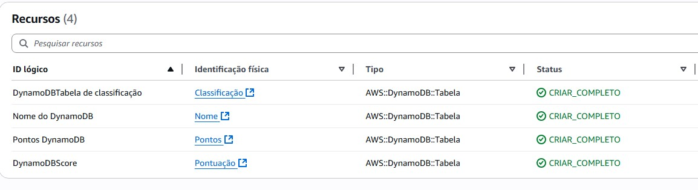
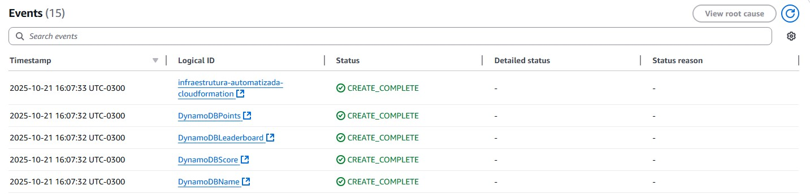

# 🚀 Infraestrutura Automatizada com AWS CloudFormation

## 📋 Sobre o Desafio  
Projeto desenvolvido para o desafio **DIO de CloudFormation**, implementando uma infraestrutura automatizada na AWS usando **Infrastructure as Code (IaC)**.

---

## 🛠️ O que é CloudFormation?  
**AWS CloudFormation** é um serviço que permite modelar e configurar recursos AWS usando templates.  
Você cria um arquivo **YAML** ou **JSON** que descreve todos os recursos necessários, e o CloudFormation cuida de provisionar e configurar tudo automaticamente.

---

## ⚡ CloudFormation vs Terraform  

### ☁️ **AWS CloudFormation**
- ✅ **Nativo da AWS** – Integração total com serviços AWS  
- ✅ **Gerenciamento automático** de estado  
- ✅ **Rollback automático** em caso de erro  
- ✅ **Linguagem familiar** (YAML/JSON)  

### 🌍 **Terraform**  
- ✅ **Multi-cloud** – funciona com AWS, Azure e GCP  
- ✅ **Linguagem HCL** – mais legível  
- ✅ **Ecossistema grande** – muitos módulos disponíveis  
- ❌ **Gerenciamento de estado manual**

---

## 📝 Passo a Passo da Implementação  

### **1. Seleção do Template**  
  
Escolhi o template **`fn-foreach-ddb.yaml`**, que demonstra como criar múltiplas tabelas **DynamoDB** de uma vez usando loops.

### **2. Configuração da Stack**  
  
No Console AWS, selecionei **“Upload a template file”** e configurei a stack com o template escolhido.

### **3. Nomeação da Stack**  
  
Defini o nome da stack como **`infraestrutura-automatizada-cloudformation`**, seguindo as convenções da AWS.

### **4. Resultado Final**  
  
**✅ SUCESSO!** Foram criadas **4 tabelas DynamoDB**:
- `DynamoDBLeaderboard`  
- `DynamoDBName`  
- `DynamoDBPoints`  
- `DynamoDBScore`  

### **5. Status de Criação**  
  
Todas as tabelas foram criadas com status **`CREATE_COMPLETE`**, confirmando que o processo foi 100% bem-sucedido.

---

## 🎯 Resultados Obtidos  

### **✅ O que foi criado:**
- 4 tabelas DynamoDB automáticas  
- Stack CloudFormation funcional  
- Infraestrutura 100% como código  

### **📊 Métricas de Sucesso:**
- ⏱️ **Tempo de criação:** ~2 minutos  
- 💾 **Recursos:** 4 tabelas DynamoDB  
- 🟢 **Status:** `CREATE_COMPLETE` em todos  
- 💰 **Custo:** apenas pelo uso do DynamoDB  

---

## 💡 Benefícios da IaC  

### 🔄 **Consistência**  
Mesmo template = mesmos resultados em qualquer ambiente  

### ⚡ **Velocidade**  
Deploy de 4 bancos de dados em minutos, em vez de horas  

### 📈 **Versionamento**  
Controle de mudanças como código-fonte  

### 💰 **Economia**  
Recursos só existem quando necessário  

### 🛡️ **Segurança**  
Configurações padronizadas e auditáveis  

---

## 🎓 Aprendizados  

- Uso da função **`Fn::ForEach`** para criar recursos em loop  
- Estruturação de templates **YAML** no CloudFormation  
- Gerenciamento de **stacks** na AWS  
- Documentação técnica clara e organizada no **GitHub**

---
