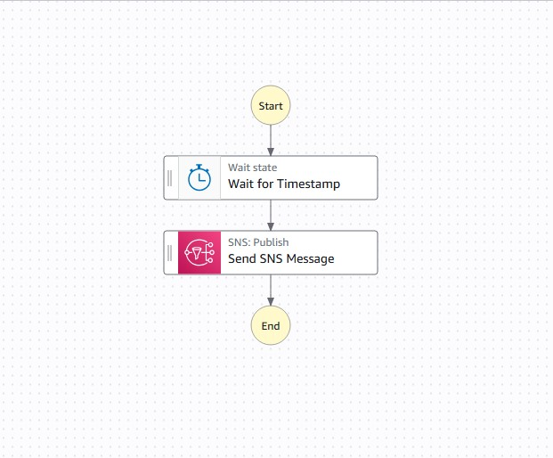

# 🚀 AWS Step Functions: Workflows Automatizados (Desafio DIO)

Documentação completa do aprendizado sobre Orquestração de Microsserviços com Máquinas de Estado.

## 🌟 I. Visão Geral: O Maestro da Orquestra AWS

O AWS Step Functions é o **serviço de orquestração visual** da AWS. Ele permite construir fluxos de trabalho *serverless* complexos conectando serviços da AWS em uma sequência lógica e robusta.

> 💡 **Analogia:** O Step Functions atua como o **Maestro** que coordena todos os instrumentos (serviços AWS) da sua arquitetura, garantindo que cada um execute sua tarefa na ordem e tempo corretos.

### O Papel Crítico do Step Functions

O Step Functions assume responsabilidades que, de outra forma, teriam que ser codificadas manualmente:

  * **Orquestração:** Define o **FLUXO** (a sequência lógica e as regras de negócio).
  * **Resiliência:** Gerencia *timeouts*, erros e tentativas (`Retry`), aumentando a tolerância a falhas.
  * **Estado:** Salva o estado da execução, permitindo fluxos de longa duração sem consumir recursos de servidor.

-----

## II. Prática: Análise do Template TaskTimer

Executei e analisei o template **TaskTimer (Temporizador de Tarefas)** para entender o funcionamento básico de um *workflow* *serverless*.

### 1\. Componentes da Máquina de Estado

O *workflow* é composto pelos seguintes **States** (Estados):

  * **State Machine:** O *workflow* completo; usei o modelo `TaskTimer`.
  * **`Wait for Timestamp`:** O estado que pausa a execução por um tempo predefinido (utilizado para a espera de 10 segundos).
  * **`Send SNS Message`:** O estado de ação, responsável pelo envio de uma notificação através do **Simple Notification Service (SNS)**.

### 2\. Fluxo de Dados (Input/Output)

O Step Functions demonstrou sua capacidade de passar dados automaticamente entre os estados utilizando o seguinte JSON de entrada:

```json
{
  "topic": "arn:aws:sns:...",    // O tópico SNS que receberá a mensagem.
  "message": "HelloWorld",       // O conteúdo da notificação.
  "timer_seconds": 10            // O tempo de espera configurado para o estado Wait.
}
```

-----

## III. Resultados e Monitoramento da Execução

A execução (ID: `9242ffe3-60e4-...`) foi concluída com sucesso, conforme o painel de monitoramento da AWS.

### Detalhes da Execução


*Figura: Workflow executado com sucesso - Status "Com êxito"*

**Status Registrado e Aprendizados:**

  * **Status Final:** **Com êxito** ✅.
  * **Tipo de Execução:** **Standard**. Confirma que o *workflow* é adequado para processos que exigem longa duração ou rastreamento completo.
  * **Transições de Estado:** O sistema registrou **4 transições de estado**. O fluxo seguiu a sequência: *Início → Wait State → Send SNS Message → Fim*.
  * **Duração:** **Aproximadamente 10 segundos**, tempo determinado pela variável `timer_seconds` do Input.

-----

## IV. Aprendizados Consolidados

O ponto mais importante que absorvi é a separação de responsabilidades na arquitetura *serverless*:

> 📢 **Step Functions não executa código; ele COORDENA quem executa\!**

### Vantagens Chave Descobertas

  * **Rastreabilidade Total:** A **Visualização do Gráfico** é uma ferramenta poderosa para *debugging*, permitindo ver exatamente em qual passo um processo falhou.
  * **Reutilização:** Posso executar o mesmo *workflow* infinitas vezes, simplesmente alterando o JSON de **Input** (e.g., mudar o tempo de espera ou o destinatário).
  * **Desacoplamento:** O fluxo é totalmente independente dos serviços que ele chama, tornando a arquitetura mais modular e fácil de manter.

### Casos de Uso Reais (Modelos Mentais)

  * **Follow-up (Espera):** Usar o estado `Wait` para agendar um email de *follow-up* ou uma ação de retargeting 24 horas após uma compra.
  * **Processamento de Pedidos:** Orquestrar etapas sequenciais complexas: `Validação de Estoque` → `Processamento de Pagamento (com Retries)` → `Acionamento de Logística`.
  * **ETL:** Coordenar o fluxo de dados: `Busca` (S3) → `Transformação` (Lambda) → `Carregamento` (DynamoDB).

## V. 🚀 Próximos Passos (Evolução Contínua)

Meu plano de ataque para aprofundamento é o seguinte:

1.  **Criação Customizada:** Construir meu próprio *workflow* do zero.
2.  **Integração Profunda:** Adicionar uma **Função AWS Lambda** com código customizado ao fluxo.
3.  **Resiliência na Prática:** Implementar o tratamento de erros (`Catch`) e as tentativas automáticas (`Retry`) em um estado **Task** para simular falhas reais.
4.  **Complexidade:** Explorar o estado **Parallel** para executar etapas que não dependem uma da outra simultaneamente, otimizando o tempo de execução.
